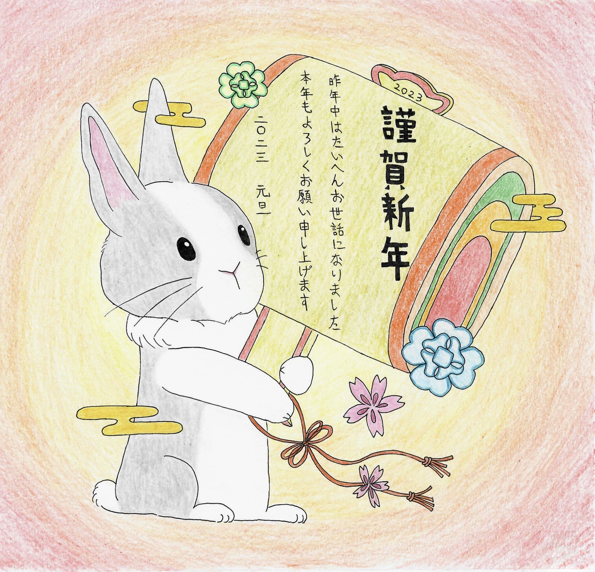

# My Art Journey
---
## Nengajo（年賀状） Collection
Since 2020, I have been drawing a "Nengajo" (New Year's card) every year. This is a tradition I cherish to mark the beginning of each year.

| Year | Zodiac (干支) | Illustration |
|:---:|:---:|:---:|
| **2025** | **Snake** (巳 - み) |  |
| **2024** | **Dragon** (辰 - たつ) |  |
| **2023** | **Rabbit** (卯 - う) |  |
| **2022** | **Tiger** (寅 - とら) |  |
| **2021** | **Ox** (丑 - うし) |  |
| **2020** | **Rat** (子 - ね) |  |

---

## More Original Artworks
Besides New Year's cards, I also create original illustrations.

👉 **[Check out my Original Works here!](./Illustration-Collection)**

---

## Tools
- Procreate
- Hand-drawn
